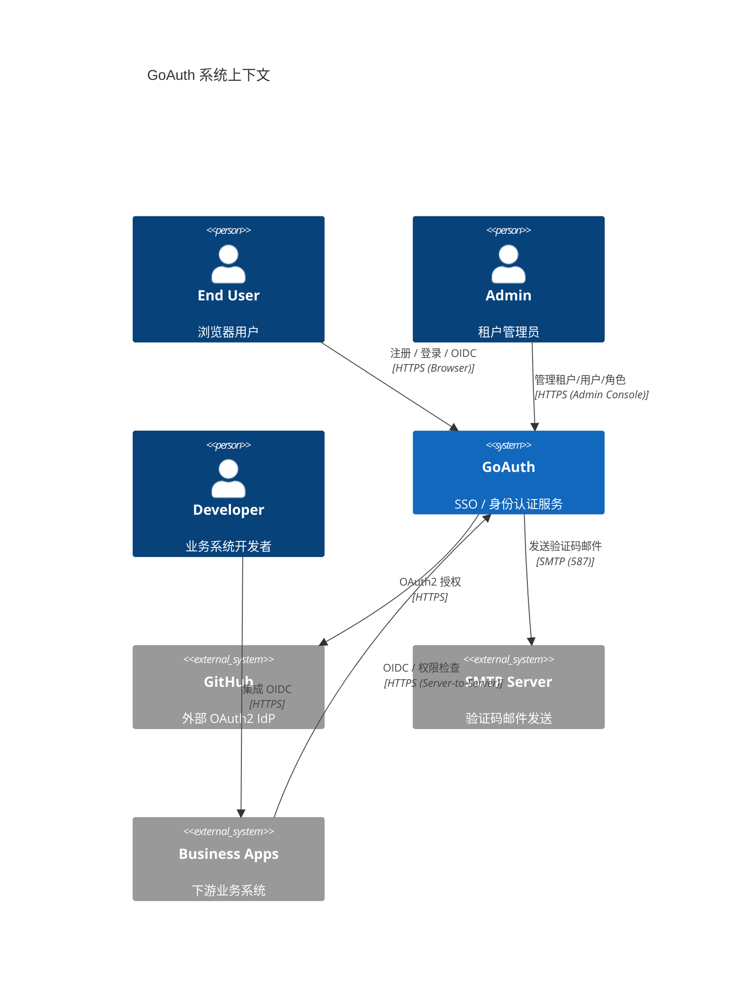

# 01 — System Context

GoAuth 在整个生态系统中的位置和外部依赖。

## C4 Level 1: System Context

## 外部系统

| 系统 | 协议 | 用途 | 必选 |
|------|------|------|------|
| **MySQL** | TCP 3306 | 权威数据存储：用户、租户、角色、权限、OAuth Client、会话、审计日志 | ✅ |
| **Redis** | TCP 6379 | 验证码、限流计数、登录挑战、权限缓存、JTI 黑名单 | ✅ |
| **SMTP Server** | SMTP (587/465) | 发送邮箱验证码（注册/密码重置） | 生产必选 |
| **GitHub OAuth** | HTTPS | 外部 OAuth2 登录（可选配置） | ❌ |
| **Business Apps** | HTTPS | 下游业务系统通过 OIDC 接入或调用 `/v1/authz/check` 鉴权 | — |

## 用户角色

| 角色 | 交互方式 | 典型操作 |
|------|---------|---------|
| **End User** | 浏览器 → 前端 SPA → identity-service | 注册、邮箱登录、GitHub 登录、2FA、密码重置、个人中心 |
| **Admin** | 浏览器 → Admin Console → identity-service | 创建/管理租户、用户、角色、权限、OAuth Client、查看审计日志 |
| **Developer** | 代码集成 | 注册 OAuth Client、实现 OIDC Authorization Code 流程、调用权限检查 API |

## 关键约束

- identity-service 是**唯一权威的身份来源**，业务系统不存储用户密码或会话
- Redis 是**运行时必需依赖**——不可用则服务启动失败（不是降级模式）
- 自托管：不依赖 SaaS 身份服务（GitHub 登录是可选的增强功能）
- 所有令牌（Access Token / Refresh Token / OIDC Cookie）由 identity-service 签发，业务系统只做验证
