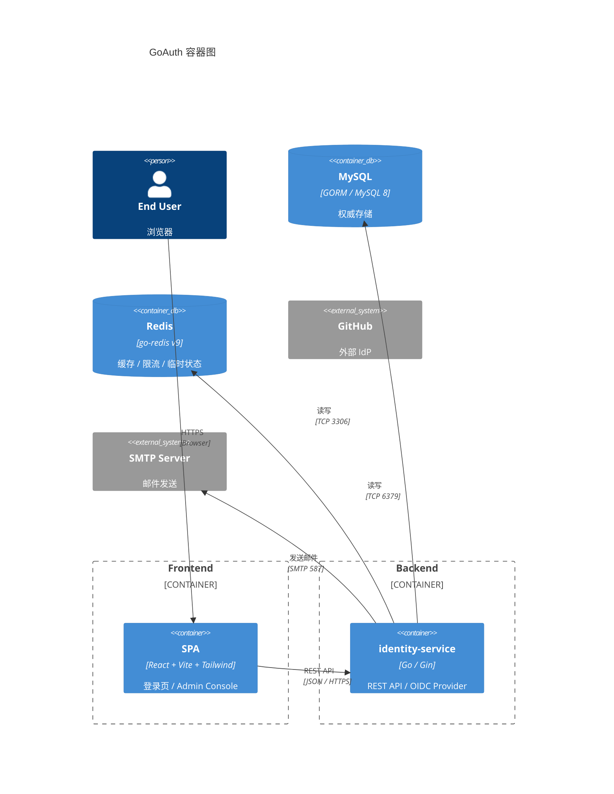

# 02 — Container Architecture

GoAuth 的运行容器及其职责、技术栈、通信方式。

## C4 Level 2: Containers



## 容器清单

| 容器 | 技术栈 | 职责 | 端口 |
|------|--------|------|------|
| **SPA** | React 18 + Vite + Tailwind CSS | 登录/注册 UI、账户中心、Admin Console | `3000` (dev) |
| **identity-service** | Go 1.24 + Gin + GORM v2 | 全部后端逻辑：认证、OIDC Provider、RBAC、用户/租户管理 | `8080` (默认) |
| **MySQL** | MySQL 8 | 权威数据存储（17 张表） | `3306` |
| **Redis** | Redis 7 | 验证码（10min TTL）、限流计数器、2FA 挑战（5min）、权限缓存（2min）、JTI 黑名单 | `6379` |

## 容器间通信

```
Browser ──HTTPS──▶ SPA (登录/管理页面)
SPA     ──REST──▶ identity-service (JSON API)
Browser ──HTTP──▶ identity-service (OIDC 重定向: /oauth2/authorize → 302 → /login)
identity-service ──TCP──▶ MySQL (GORM, 连接池)
identity-service ──TCP──▶ Redis (go-redis, 连接池)
identity-service ──SMTP──▶ SMTP Server (STARTTLS on 587)
```

## 部署拓扑

```
                    ┌──────────────┐
                    │   Nginx /    │
                    │   Ingress    │
                    └──┬──────┬────┘
                       │      │
              ┌────────┘      └────────┐
              ▼                        ▼
     ┌─────────────────┐    ┌─────────────────┐
     │ identity-service│    │   SPA (静态)     │
     │    :8080        │    │   托管在 Nginx   │
     └───┬──────┬──────┘    └─────────────────┘
         │      │
    ┌────┘      └────┐
    ▼                ▼
┌────────┐    ┌──────────┐
│ MySQL  │    │  Redis   │
└────────┘    └──────────┘
```

- **本地开发**：Docker Compose 启动 identity-service + MySQL + Redis；SPA 用 `npm run dev` 独立启动
- **生产**：Nginx 反代 identity-service 并托管 SPA 静态文件；MySQL/Redis 使用外部托管实例
