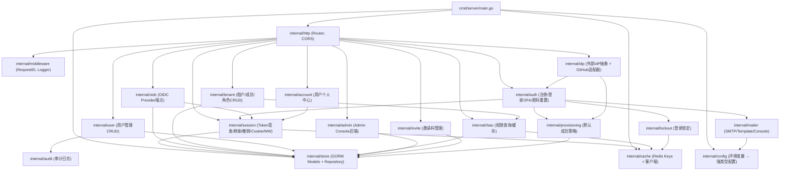

# 03 — Component Architecture

identity-service 的内部包结构和分层规范。

## 包依赖图



## 分层规范

```
┌─────────────────────────────────────────┐
│  Handler (HTTP 层)                       │
│  - 绑定请求参数                          │
│  - 调用 service 方法                     │
│  - 返回 JSON 响应                        │
│  - 不包含业务逻辑                        │
├─────────────────────────────────────────┤
│  Service (业务层)                        │
│  - 业务规则和流程编排                    │
│  - 调用 repository / 外部服务            │
│  - 不感知 HTTP (不引用 gin.Context)      │
├─────────────────────────────────────────┤
│  Repository (数据层)                     │
│  - GORM CRUD 操作                        │
│  - 查询构建                              │
│  - 不包含业务判断                        │
├─────────────────────────────────────────┤
│  Database / Cache                        │
│  - MySQL (GORM)                          │
│  - Redis (go-redis v9)                   │
└─────────────────────────────────────────┘
```

**硬约束**：
- Handler 不可直接调用 Repository，必须通过 Service
- Service 不可导入 `gin` 包
- Redis key 定义统一放在 `internal/cache/keys.go`
- 跨包依赖只能从上到下（Handler → Service → Repository），不可反向

## 包职责一览

| 包 | 文件数 | 核心职责 |
|----|--------|---------|
| `auth` | 6 | 邮箱验证码、注册、密码登录、2FA、密码重置 |
| `session` | 7 | Access/Refresh Token 签发与轮换、OIDC SSO Cookie、认证中间件 |
| `oidc` | 11 | OIDC Provider：授权端点、Token端点、UserInfo、JWKS、Discovery、登出 |
| `idp` | 4 | 外部 IdP 抽象：GitHub 浏览器登录 + token 交换 |
| `rbac` | 2 | 权限查询（缓存 + DB 回源）、权限校验 handler |
| `tenant` | 4 | 租户 CRUD、成员管理、角色 CRUD、权限授权/撤销 |
| `user` | 3 | 用户 CRUD、批量操作、系统用户保护 |
| `admin` | 3 | Admin Console 仪表盘、审计日志、运行时配置、权限管理 |
| `account` | — | 用户个人中心：资料编辑、头像、2FA 管理、会话管理 |
| `invite` | 2 | 邀请码生成/兑换（邀请制注册） |
| `store` | 5 | 17 个 GORM 模型、AutoMigrate、Repository 实现 |
| `cache` | 2 | Redis 客户端初始化 + 类型化 key 生成函数 |
| `config` | 2 | 60 个环境变量 → 强类型 `Config` 结构体 |
| `middleware` | 2 | RequestID、StructuredLogger |
| `mailer` | 3 | SMTP/Console/Noop 邮件发送 + Go 模板引擎 |
| `lockout` | — | 登录失败锁定（Redis 计数器 + 阈值） |
| `provisioning` | — | 新用户默认租户分配策略 |

## 文件拆分准则

- **100-500 行**一个文件为最佳
- 按**功能关注点**拆分，不是按类型
- 同一个 struct 的方法**可以跨文件**（Go 语言特性）
- Handler struct + 路由注册留在 `handler.go`，具体功能拆到 `handler_<feature>.go`

## 启动流程

```
main()
  ├─ config.Load()          ← 解析全部环境变量
  ├─ store.OpenDB()         ← 连接 MySQL
  ├─ store.AutoMigrate()    ← 自动建表 (17 models)
  ├─ bootstrapAdminUser()   ← 幂等创建 root 管理员
  ├─ jwtkey.Load()          ← 从文件/keyset 加载 JWT 签名密钥
  ├─ cache.OpenRedis()      ← 连接 Redis (失败则 fatal)
  ├─ buildServices()        ← 按依赖顺序创建所有 Service
  │   ├─ audit → ratelimit → logout
  │   ├─ session → oidc → provisioning → lockout
  │   ├─ password → captcha → mailer
  │   ├─ rbac → tenant → user
  │   └─ idp (条件: GitHub 已配置)
  ├─ buildRouter()          ← 组装 Gin Router + 注册全部路由
  └─ router.Run()           ← HTTP 监听
```

详见 `services/identity-service/cmd/server/main.go:73-134`。
