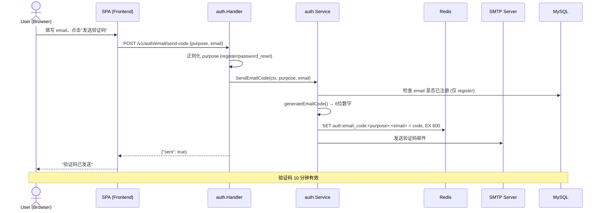
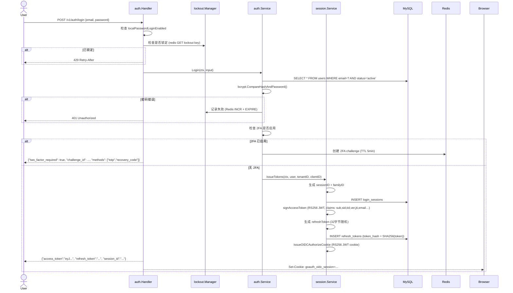
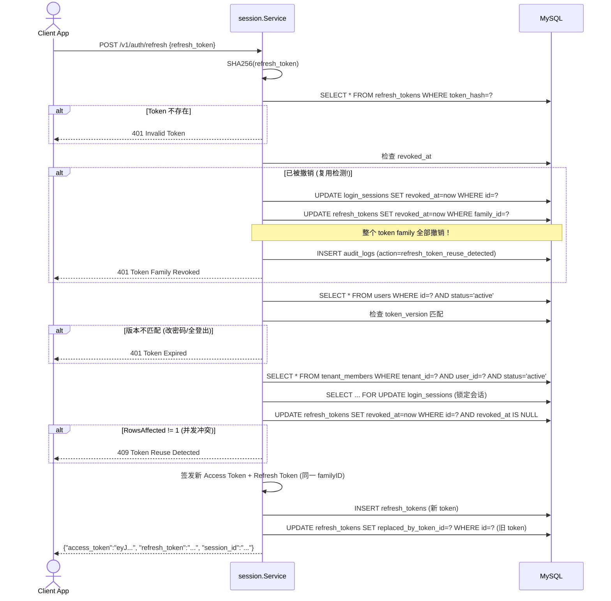
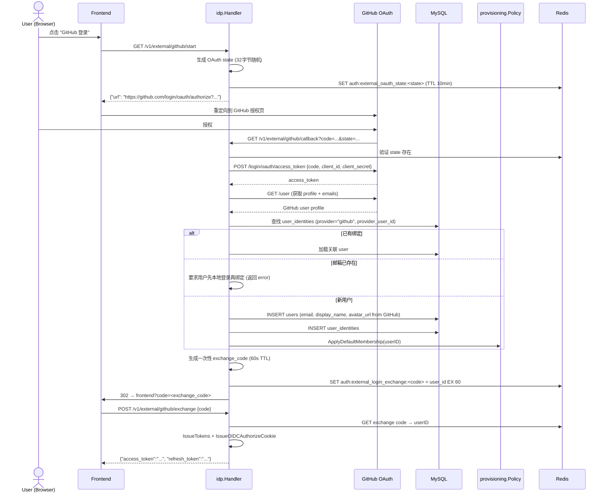

# 05 — Authentication Flows

核心认证流程的时序图，基于真实代码路径。

## 1. 邮箱注册 + 验证码发送



## 2. 密码登录 → Token 签发



## 3. Token 刷新 + 复用检测



## 4. OIDC Authorization Code + PKCE

```mermaid
sequenceDiagram
    actor U as User (Browser)
    participant Biz as Business App
    participant OIDC as oidc.Handler
    participant DB as MySQL

    Note over U,OIDC: Step 1: 授权请求
    U->>Biz: 点击"使用 GoAuth 登录"
    Biz->>U: 302 → /oauth2/authorize?client_id=...&redirect_uri=...&code_challenge=...&state=...
    U->>OIDC: GET /oauth2/authorize?...
    OIDC->>DB: 验证 client_id (存在 + active + 支持 authorization_code)
    OIDC->>DB: 验证 redirect_uri 匹配注册值
    OIDC->>OIDC: 验证 code_challenge 存在 (PKCE 强制)
    OIDC->>Browser: 读取 goauth_oidc_session cookie

    alt 无有效 SSO Cookie
        OIDC->>U: 302 → /login?return_to=/oauth2/authorize?...
        U->>SPA: 登录页 → 完成登录
        SPA->>OIDC: 返回 /oauth2/authorize (带 cookie)
    end

    OIDC->>OIDC: 验证 cookie JWT 签名 (RS256)
    OIDC->>DB: 检查 LoginSession 活跃 + 用户 active
    OIDC->>DB: 检查租户成员身份
    OIDC->>OIDC: 生成 authorization_code (32字节随机)
    OIDC->>DB: INSERT oauth_authorization_codes (code_hash=SHA256(code), ...)
    OIDC->>U: 302 → redirect_uri?code=<code>&state=<state>

    Note over U,DB: Step 2: Token 交换
    U->>Biz: GET /callback?code=...&state=...
    Biz->>Biz: 验证 state 匹配 (防 CSRF)
    Biz->>OIDC: POST /oauth2/token {grant_type:"authorization_code", code, code_verifier, redirect_uri}
    OIDC->>DB: SELECT * FROM oauth_authorization_codes WHERE code_hash=SHA256(code)
    OIDC->>OIDC: 交叉验证: client_id, redirect_uri, tenant_id
    OIDC->>OIDC: 检查 consumed_at IS NULL + expires_at > now
    OIDC->>OIDC: PKCE 验证: S256 → SHA256(verifier) vs challenge; plain → 直接比较
    OIDC->>DB: 检查 user active + 租户成员身份
    OIDC->>DB: SELECT ... FOR UPDATE login_sessions
    OIDC->>DB: UPDATE oauth_authorization_codes SET consumed_at=now (原子消费)
    OIDC->>OIDC: signAccessToken (OIDC-scoped, token_use="oidc")
    OIDC->>OIDC: signIDToken (OIDC claims: sub,aud,nonce…)
    OIDC->>OIDC: 如果 scope 含 offline_access → 生成 RefreshToken
    OIDC-->>Biz: {"access_token":"...", "id_token":"...", "refresh_token":"...", "token_type":"Bearer"}
    Biz->>OIDC: GET /oauth2/userinfo (Authorization: Bearer access_token)
    OIDC-->>Biz: {"sub":"1", "email":"user@example.com", ...}
```

## 5. GitHub 外部登录



## 6. 浏览器 SSO Cookie 流程

```mermaid
sequenceDiagram
    actor U as User (Browser)
    participant SPA as Frontend
    participant Session as session.Service
    participant OIDC as oidc.Handler

    Note over U,OIDC: 登录时签发 SSO Cookie
    U->>SPA: 成功登录
    SPA->>Session: IssueTokens
    Session->>Session: IssueOIDCAuthorizeCookie(user, tenantID, sessionID)
    Session->>Browser: Set-Cookie: goauth_oidc_session=<JWT>; SameSite=Lax; HttpOnly; Path=/
    Note over Session,Browser: Cookie JWT claims: purpose="oidc_authorize", sub=userID, sid=sessionID, tid=tenantID

    Note over U,OIDC: 后续 OIDC 授权自动通过
    U->>OIDC: GET /oauth2/authorize?client_id=...
    OIDC->>Browser: 自动附带 goauth_oidc_session cookie
    OIDC->>OIDC: ParseOIDCAuthorizeCookie (验证 RS256 签名 + purpose)
    OIDC->>OIDC: 提取 userID + sessionID
    OIDC->>DB: 验证 LoginSession 活跃 + user active
    OIDC->>OIDC: 生成 authorization_code (无需用户交互)
    OIDC->>U: 302 → redirect_uri?code=...

    Note over U,OIDC: 登出时清除
    U->>OIDC: POST /v1/auth/logout
    OIDC->>Session: ClearOIDCAuthorizeCookie()
    OIDC->>Browser: Set-Cookie: goauth_oidc_session=; Max-Age=0
```
