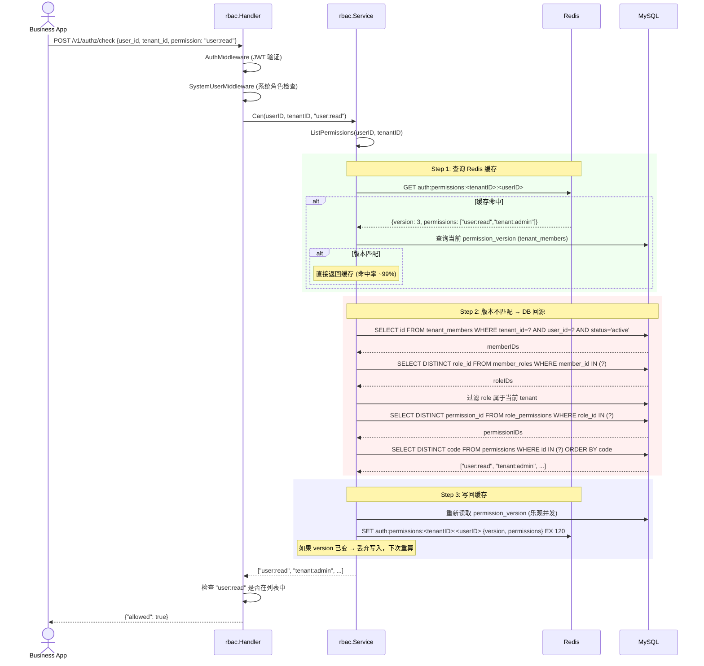
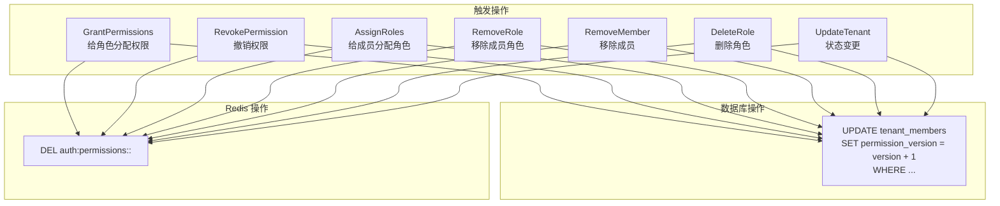

# 06 — RBAC Model

GoAuth 基于租户的 RBAC 权限模型和权限检查流程。

## 权限模型关系图

```mermaid
graph LR
    subgraph "全局"
        Perm["Permission<br/>code: 'user:read'<br/>resource + action"]
    end

    subgraph "租户 Tenant A"
        direction TB
        UserA1[User]
        UserA2[User]
        TmA1[TenantMember<br/>status=active<br/>permission_version]
        TmA2[TenantMember]
        RoleAdmin[Role: admin<br/>is_system=false]
        RoleMember[Role: member<br/>is_system=false]
        RpAdmin[RolePermission]
        RpMember[RolePermission]
        MrA1[MemberRole]
        MrA2[MemberRole]

        UserA1 --> TmA1
        UserA2 --> TmA2
        TmA1 --> MrA1
        TmA2 --> MrA2
        MrA1 --> RoleAdmin
        MrA2 --> RoleMember
        RoleAdmin --> RpAdmin
        RoleMember --> RpMember
        RpAdmin --> Perm
        RpMember --> Perm
    end

    subgraph "租户 Tenant B (system)"
        UserS[User (系统用户)]
        TmS[TenantMember]
        RoleRoot[Role: root<br/>is_system=true]
        MrS[MemberRole]
        RpRoot[RolePermission]

        UserS --> TmS
        TmS --> MrS
        MrS --> RoleRoot
        RoleRoot --> RpRoot
        RpRoot --> Perm
    end
```

## 实体关系

```
User  (全局唯一)
  │
  │ 1:N
  ▼
TenantMember  (每租户最多一条记录，唯一约束 (tenant_id, user_id))
  │  - status: "active" | "disabled"
  │  - permission_version: 缓存版本号
  │
  │ 1:N
  ▼
MemberRole  (成员与角色的多对多映射)
  │
  │ N:1
  ▼
Role  (租户内，唯一约束 (tenant_id, code))
  │  - is_system: true = 受保护角色，不可被用户删除/禁用
  │
  │ 1:N
  ▼
RolePermission  (角色与权限的多对多映射)
  │
  │ N:1
  ▼
Permission  (全局唯一，code 如 "user:read")
  - resource: "user", "tenant", "oauth_client" ...
  - action: "read", "write", "delete", "admin"
  - code: "user:read", "tenant:admin" ...
```

## 权限检查流程



## 缓存失效机制



## 系统用户

**不是单独的表**，是一种约定：

- 用户在 `"system"` 租户 (slug="system") 有一个活跃的 `TenantMember`
- 该成员持有一个 `Role`，其 `is_system = true` 或 `code ∈ ("root", "system-admin", "system_admin")`

**特权**：
- 可以通过 `SystemUserMiddleware`（访问 `/v1/admin/*` 等管理端点）
- **不能被 DisableUser**——保护角色检查 `isProtectedUser(userID)` 返回 true 时拒绝

**引导** (`user/service.go:MarkSystemUser`)：
1. Upsert `Tenant{slug:"system"}`
2. Upsert `TenantMember{user_id, tenant_id(system)}`
3. Upsert `Role{tenant_id, code:"root", is_system:true}`
4. Assign `MemberRole{member_id, role_id}`

## 受保护角色

角色 code 在以下列表中时不可被禁用对应的用户：

```go
var protectedRoleCodes = []string{"root", "system-admin", "system_admin"}
```

详见 `services/identity-service/internal/user/service.go:22`。
